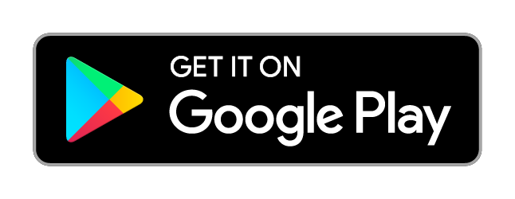

  

<h1 align="center">Savr</h1>

  A no-nonsense bookmark app for Android. Paste a link. That's it.

  

  
  

---

## Why Savr?

Every bookmark app I tried was either crammed with features I'd never touch or wanted a monthly subscription just to save a URL. So I built the thing I actually wanted: drop a link, grab the metadata, move on.

**No signups. No cloud. No ads. No trackers.** Your bookmarks live on your phone — where they belong.

## Features

- **Auto Metadata** — Paste any URL and Savr grabs the title, description, and preview image automatically.
- **Edit Bookmarks** — Open any bookmark in a full-screen editor with live preview and update its title, description, and metadata on the spot.
- **Clipboard Detection** — Copy a link anywhere and Savr offers to save it instantly, with a preview before you add it. Already-saved links are recognized, not duplicated.
- **Quick Save** — Share a URL to Savr from any app to save it fast, without even opening the app.
- **Collections** — Group bookmarks without nested folders. Name it, throw links in, move on.
- **Selection Mode** — Long-press a bookmark, then batch delete or move multiple at once.
- **Quick Preview** — Tap any bookmark to see what's inside before opening it in your browser.
- **Search & Sort** — Search by title or URL; sort by date added or alphabetically, either direction.
- **Custom Tap Action** — Set a single tap to preview, open in browser, or copy the link.
- **Grid or List** — Cards or a compact list. Flip between them whenever.
- **Export & Import** — JSON or HTML, including bookmark exports from Chrome, Firefox, and other browsers.
- **Auto Backup** — Automatic daily backup to your Downloads folder.
- **Material You** — Matches your wallpaper, with a true-black AMOLED theme that saves battery. Light, dark, or system default.

## Privacy

Savr has nothing to track you with. There are **no accounts, no analytics, no ads, and no cloud** — everything stays on your device. Even crash reports never leave your phone: if something goes wrong, the full report is saved locally and you can review or share it from **Settings → About → Crash logs**.

## Screenshots

| Home (Grid) | Home (List) | Collections |
|:---:|:---:|:---:|
|  |  |  |

| Settings | Image Preview | Light Theme |
|:---:|:---:|:---:|
|  |  |  |

## Download

- **Google Play** — the recommended way to get Savr: <a href="http://play.google.com/store/apps/details?id=com.zarnth.savr">install from the Play Store</a>.
- **GitHub Releases** — the latest signed `app-release.apk` for direct download, plus the `app-release.aab` for the Play Store: [see releases](https://github.com/qeiq/Savr/releases/latest).

## Built With

| | |
|---|---|
| **Language** | Kotlin |
| **UI** | Jetpack Compose + Material 3 |
| **Architecture** | MVI + StateFlow |
| **DI** | Koin |
| **Database** | Room |
| **Networking** | OkHttp, Jsoup |
| **Images** | Coil |

## Support

Savr is free, open source, and ad-free. If it saves you a headache or two, a coffee is always appreciated — support development on [Patreon](https://www.patreon.com/zarnth).

  

## Credits

Metadata parsing powered by [Android-Link-Preview](https://github.com/vishalkumarsinghvi/Android-Link-Preview) by Vishal Kumar Singhvi.

## License

Savr is licensed under the [GNU General Public License v3.0](LICENSE). Third-party components retain their own licenses.

## Found a bug? Got an idea?

[Open an issue](https://github.com/qeiq/Savr/issues). Or just say hi — I don't bite.

If this app saves you even one headache, a star would mean a lot.
